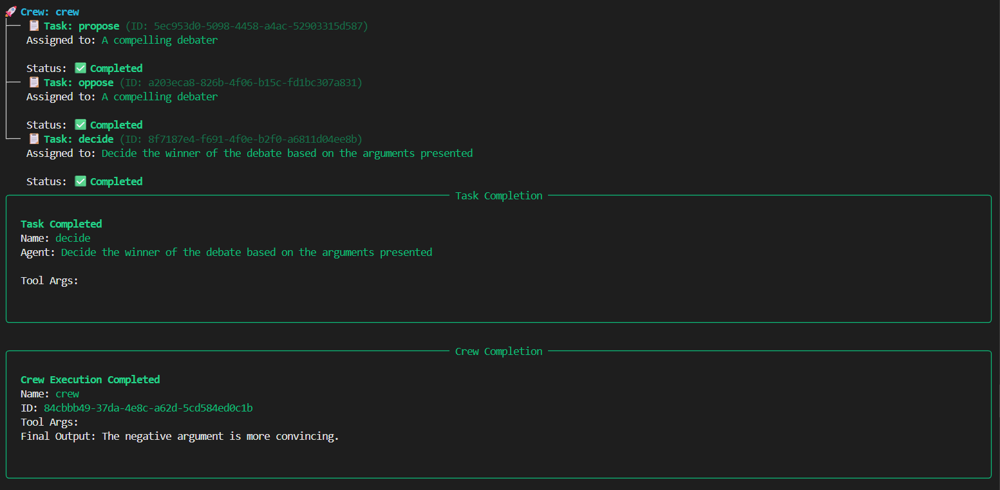

# AI Debate Crew

Welcome to the AI Debate Crew project, powered by [crewAI](https://crewai.com). This project creates an intelligent debate system where AI agents argue for and against a given motion, with a judge determining the winner based on the strength of arguments presented.

## Project Overview

This multi-agent system simulates a formal debate with three key roles:
- **Debater (Pro)**: Presents compelling arguments in favor of the motion
- **Debater (Con)**: Presents strong counter-arguments against the motion  
- **Judge**: Evaluates both sides and declares the winner based on argument quality

## Installation

Ensure you have Python >=3.10 <3.14 installed on your system. This project uses [UV](https://docs.astral.sh/uv/) for dependency management and package handling, offering a seamless setup and execution experience.

First, if you haven't already, install uv:

```bash
pip install uv
```

Next, navigate to your project directory and install the dependencies:

```bash
crewai install
```

### Configuration

**Add your `GEMINI_API_KEY` into the `.env` file**

Create a `.env` file in the root directory:
```bash
GEMINI_API_KEY=your-api-key-here
```

**Customize the debate system:**
- `src/debate/config/agents.yaml` - Defines the debater and judge agents
- `src/debate/config/tasks.yaml` - Defines the propose, oppose, and decide tasks
- `src/debate/crew.py` - Contains the crew logic and agent orchestration
- `src/debate/main.py` - Entry point with motion input configuration

## Running the Project

To start the debate, run this from the root folder of your project:

```bash
crewai run
```

This command initializes the Debate Crew, where:
1. The debater agent proposes arguments in favor of the motion
2. The debater agent presents opposing arguments against the motion
3. The judge evaluates both sides and declares a winner

### Output

The debate results are saved as markdown files in the `output/` directory:
- `output/propose.md` - Arguments in favor of the motion
- `output/oppose.md` - Arguments against the motion
- `output/decide.md` - Judge's decision and reasoning

## Example Usage

Modify the motion in `src/debate/main.py` to debate different topics:

```python
inputs = {
    'motion': 'Artificial Intelligence will do more good than harm to humanity'
}
```


## Debate Execution Flow



## Support

For support, questions, or feedback regarding crewAI:
- Visit the [crewAI documentation](https://docs.crewai.com)
- Check out the [GitHub repository](https://github.com/joaomdmoura/crewai)
- [Join the Discord community](https://discord.com/invite/X4JWnZnxPb)
- [Chat with the docs](https://chatg.pt/DWjSBZn)

---

*Built with the power and simplicity of crewAI - enabling AI agents to collaborate and debate complex topics.*
